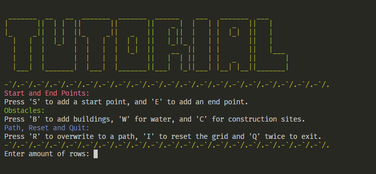
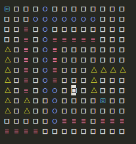
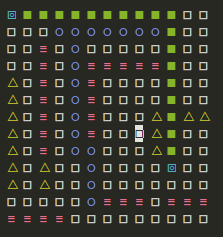

<h1 align=center>🛣️ Route Calculator</h1>

## 👀 Overview

This project provides a visual interface for demonstrating pathfinding algorithms using the `curses` library in Python. The grid-based system allows users to set start and end points, place obstacles, and visualize the A\* pathfinding algorithm in action.

## 🔎 Features

- **Grid-based Visualization:** Interactively create a grid and visualize the pathfinding process.
- **Customizable Obstacles:** Place different types of obstacles with varying movement costs.
- <strong>A\* Algorithm:</strong> Efficiently finds the shortest path between start and end points.
- **Curses-based Interface:** Uses the `curses` library for terminal-based graphics.

## 🕹️ Controls

- Arrow Keys: Move the cursor.
- 1: Set the start point.
- 2: Set the end point.
- 3: Reset a cell to empty.
- 4: Place a building (impassable obstacle).
- 5: Place water (high movement cost).
- 6: Place a construction site (medium movement cost).
- a: Run the A\* pathfinding algorithm.
- 0 : Reset the entire grid.
- q: Quit the application.

### 📦 More Screenshots

